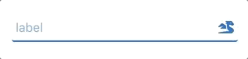

# adesso-input

A Web Component for input field.

  ### installation:
  `npm install adesso-input --save`

  To use this web component, you need to install "validator.js" aswell. If you dont already have it

  `npm install validator --save`

  ### usage:
  first import script to your page

  ```
    import "adesso-input";
  ```
  then in your markup
  ```
    <adesso-input
        required
        type="text"
        label="label"
        minlength="5">
        <i slot="rightIcon" className="fas fa-dragon"/>
    </div>
  ```
  


  ## Attributes:

  | Attribute | Description | type | default| required |
  | --- | --- | --- | --- | --- |
  | `alpha` | alpha character validation | Boolean | false | no |
  | `animated` | label is static if this attiribute does not exist | Boolean | false | no |
  | `error-message` | message to show when error occurs | String | false | no |
  | `invalid` | set this as input exptected to be invalid | Boolean | false | no |
  | `label` | label above input field | String | none | no |  
  | `lang` | language code | String | en-US | no |
  | `maxlength` | maximum number of character enabled | String | none | no |
  | `minlength` | minimum number of character for validation | String | none | no |
  | `pattern` | patter to mask user input "A" for alpha chars "1" for numbers | String | none | no |
  | `placeholder` | placeholder | String | none | no |
  | `regex` | regex to validate against | String | none | no |
  | `required` | validation for empty | Boolean | none | no |
  | `type` | input type | String | none | yes |
  | `value` | input value for controlled input. event fired on input change is "textChanged" | String | none | no |
  
  ## Events:
  
  | Event | Description | required |
  | --- | --- | --- |
  | `errorEvent` | fires with an error key when validation fails you can access key with "event.detail.key"  | no |
  | `textChanged` | fires with value of input when text changed you can access value with "event.detail.value" | no |
  
  
  
  ## Contributing:
  
  Feel free to make your "Pull Request" 🏆

  ## Future:
  
  - [x] Notify parent component about "errorKey". Possible solition would be firing a custom event
  - [x] Add input mask for custom pattern.
  - [ ] Add more options for pattern and validation.
  - [ ] Add testing.
